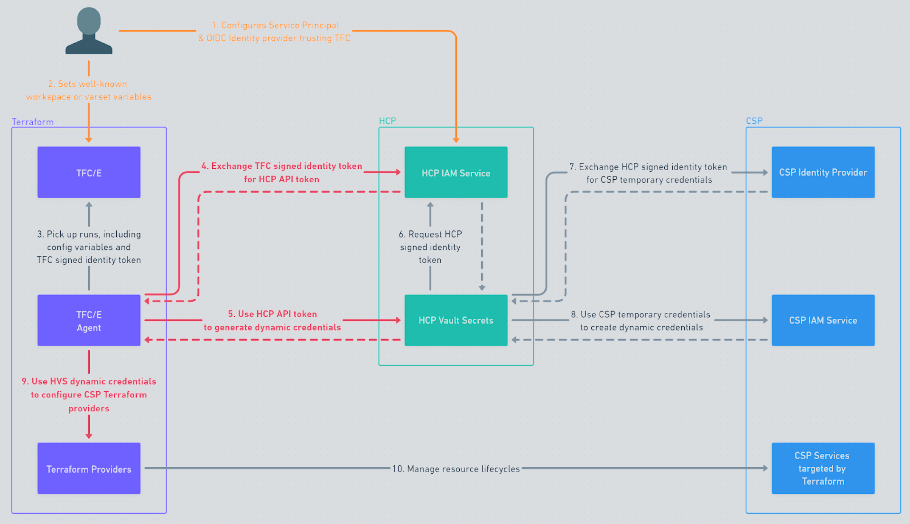

This repository contains Terraform for:

- Creating an HVS Application
- Configure AWS Dynamic Credentials
- Configuring the OIDC Provider, IAM roles/policies on the AWS side
- Configuring OIDC from TFC to HCP

[YouTube - HCP Vault Secrets dynamic credentials for HCP Terraform](https://www.youtube.com/watch?v=g2juG4qJP6w)

[Documentation - HCP Vault Secrets - AWS Dynamic Secrets](https://developer.hashicorp.com/hcp/docs/vault-secrets/dynamic-secrets/aws)

[Documentation - HCP Vault Secrets-Backed Dynamic Credentisl](https://developer.hashicorp.com/terraform/cloud-docs/workspaces/dynamic-provider-credentials/hcp-vault-secrets-backed)